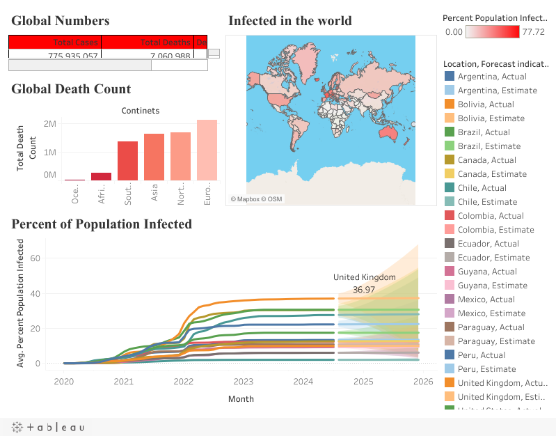

# COVID-19 Tableau Dashboard: SQL Data Preparation

The four T-SQL queries that prepared the data for my **Covid Dashboard P2** on Tableau Public: global numbers, death count by continent, infection rate by country, and infection rate over time.

> **Guided learning project.** This project follows the *Data Analyst Portfolio Project* series by
> [Alex The Analyst](https://github.com/AlexTheAnalyst/PortfolioProjects) ("Tableau Portfolio Project SQL Queries").
> I ran the queries against my own SQL Server import, adapted the excluded aggregate locations to my version of the data, and built the dashboard in Tableau Public.

## Context

Tableau Public cannot connect directly to a local SQL Server, so the course workflow is:

1. Run the aggregation queries in SQL Server.
2. Export each result to Excel.
3. Use each export as a Tableau data source.

This repository documents step 1.

## Analysis objectives

| # | Query | Dashboard element |
|---|---|---|
| 1 | Total cases, total deaths and death percentage, excluding continent aggregates | Global Numbers |
| 2 | Total deaths per continent (`continent is null` rows, excluding World, EU, International and income groups) | Global Death Count |
| 3 | Highest infection count and % of population infected, per country | Percent Population Infected (map) |
| 4 | Same as 3, per country **and date** | Percent Population Infected over time |

The dashboard sheet titles in the right-hand column were read from the published workbook (see below).

## Technologies

- Microsoft SQL Server (T-SQL) and SSMS
- Microsoft Excel (intermediate exports)
- Tableau Public

## Dataset and source

| Item | Detail |
|---|---|
| Source | [Our World in Data – COVID-19 dataset](https://github.com/owid/covid-19-data), final version of `owid-covid-data.csv` (last updated 2024-08-19; data up to 2024-08-14). License: CC BY 4.0. It is loaded into the same table as in [covid19-global-exploratory-analysis-sql](https://github.com/kevinEspinozaTech/covid19-global-exploratory-analysis-sql). |
| How the source was verified | Running these queries on that file gives exactly the figures shown on the published dashboard: 775,935,057 cases, 7,060,988 deaths and a maximum infection rate of 77.72%. |
| Included in this repo | **No.** Load scripts are provided in [covid19-global-exploratory-analysis-sql/data-prep](https://github.com/kevinEspinozaTech/covid19-global-exploratory-analysis-sql/tree/main/data-prep). |

### Expected schema

`continent`, `location`, `date`, `population`, `total_cases`, `new_cases`, `new_deaths`.

## Methodology and techniques

- **Aggregation**: `SUM`, `MAX`, `GROUP BY`.
- **Type conversion**: `CAST(new_deaths AS int)`.
- **Filtering aggregate rows**: `continent is not null` for country-level figures, and `continent is null` with `location NOT IN (...)` for continent-level figures.
- **Consistency check**: a commented-out alternative query compares the totals with the `World` row. The comment notes that the two are very close.

```sql
-- 2. Total deaths per continent
Select location, SUM(cast(new_deaths as int)) as TotalDeathCount
From [Portfolio Project 1]..['covid-data-deaths$']
Where continent is null
and location not in ('World', 'European Union (27)', 'International', 'high-income countries',
                     'upper-middle-income countries', 'lower-middle-income countries', 'low-income countries')
Group by location
order by TotalDeathCount desc
```

## Dashboard

- **Tableau Public:** [Covid Dashboard P2 – Dashboard 1](https://public.tableau.com/app/profile/kevin.espinoza1014/viz/CovidDashboardP2/Dashboard1)
- Checked on 2026-10-01 through the Tableau Public profile API. The workbook `CovidDashboardP2` is public, belongs to the profile `kevin.espinoza1014`, and contains the view `Dashboard 1` (plus `Sheet 1`–`Sheet 4`). It was first published in October 2024.
- The packaged workbook (`.twbx`) can legitimately be downloaded from Tableau Public. It is not stored here because it embeds data extracts; the live dashboard is the reference.



*Static image served by Tableau Public for this view (`Dashboard1.png?:display_static_image=y`), saved on 2026-10-02.* The shaded lines after mid-2024 in *Percent of Population Infected* are **Tableau's built-in forecast** (labelled "Estimate" in the legend), not reported data.

## Repository structure

```
.
├── SQLQuery5 TABLEAU.sql   # The four queries used as Tableau data sources
├── images/
│   └── covid-dashboard.png # Static image of the published dashboard
└── README.md
```

The second commit in the history removed an earlier block of exploratory queries from this file. That earlier version is still available in Git history.

## Results

Running the four queries on SQL Server 2025 against the OWID file (2026-10-02) completes without errors:

| Query | Result |
|---|---|
| 1. Global numbers | 775,935,057 cases · 7,060,988 deaths · **0.91%** death percentage |
| 2. Total deaths per continent | Europe 2,102,377 · North America 1,671,512 · Asia 1,637,335 · South America 1,357,619 · Africa 259,121 · Oceania 33,024 |
| 3. Highest infection rate | Cyprus 77.72% (also the top value of the dashboard map legend) |

These match the figures shown on the dashboard.

## How to run

1. Prepare the `covid-data-deaths$` table as described in [covid19-global-exploratory-analysis-sql](https://github.com/kevinEspinozaTech/covid19-global-exploratory-analysis-sql).
2. Run each numbered query in SSMS and save each result as a separate Excel file.
3. In Tableau Public, connect to the four files and rebuild the sheets, or open the published dashboard.

## Limitations

- The list of excluded aggregate locations is tied to the naming used in this final version of the dataset.
- Query 3 has no `continent is not null` filter, so aggregate rows can appear in the country ranking.
- The manual SQL → Excel → Tableau step is not automated or versioned.

## Next steps

- Replace the Excel hand-off with a reproducible export (for example `bcp` or Python).
- Fix the axis title typo "Continets" on the dashboard and republish it.

## Credits

- Course and original query structure: [Alex The Analyst – PortfolioProjects](https://github.com/AlexTheAnalyst/PortfolioProjects).

## Contact

**Kevin Espinoza**, Civil Engineer transitioning into Data Analytics and Automation
GitHub: [@kevinEspinozaTech](https://github.com/kevinEspinozaTech) · Email: [k.espinozano@gmail.com](mailto:k.espinozano@gmail.com)
